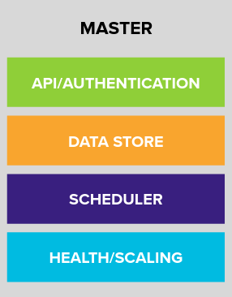

## Installation/Cluster Provisioning Verification

Cluster provisioning has already been performed for you through Advanced Cluster Manager, and the cluster is in its basic, default state.

### Logging in
To inspect the cluster installation, you can simply us the OpenShift cli, 'oc' verify the environment.

### Master Components

.OpenShift Master's 4 main responsibilities.



#### API/Authentication
The Kubernetes API server validates and configures the resources that make up a Kubernetes cluster.

Common things that interact with the Kubernetes API server are:

* OpenShift Web Console
* OpenShift `oc` command line tool
* OpenShift Node
* Kubernetes Controllers

All interactions with the API server are secured using TLS. In addition, all
API calls must be authenticated (the user is who they say they are) and
authorized (the user has rights to make the requested API calls).


#### Data Store
The OpenShift Data Store (etcd) stores the persistent master state while
other components watch etcd for changes to bring themselves into the desired
state. etcd can be optionally configured for high availability, typically
deployed with 2n+1 peer services.

[Note]
====
etcd stores the cluster's state. It is not used to store user application data.
====

#### Scheduler
The pod scheduler is responsible for determining placement of new pods onto
nodes within the cluster.

The scheduler is very flexible and can take the physical topology of the
cluster into account (racks, datacenters, etc).

#### Health / Scaling
Each pod can register both liveness and readiness probes.

Liveness probes tell the system if the pod is healthy or not. If the pod is
not healthy, it can be restarted automatically.

Readiness probes tell the system when the pod is ready to take traffic. This,
for example, can be used by the cluster to know when to put a pod into the
load balancer.

For more information on the OpenShift Master's areas of responsibility, please refer to
the
link:https://docs.openshift.com/container-platform/4.6/architecture/control-plane.html[infrastructure components section] of the product documentation.

### Examining the installation artifacts
OpenShift 4 installs with two effective superusers:

* `kubeadmin` (technically an alias for `kube:admin`)
* `system:admin`

Why two? Because `system:admin` is a user that uses a certificate to login
and has no password. Therefore this superuser cannot log-in to the web
console (which requires a password).

If you want additional users to be able to authenticate to and use the
cluster, you need to configure your desired authentication mechanisms using
CustomResources and Operators as previously discussed. LDAP-based
authentication will be configured as one of the lab exercises.

### Verifying the Installation
Let's do some basic tests with your installation. As an administrator, most
of your interaction with OpenShift will be from the command line. The `oc`
program is a command line interface that talks to the OpenShift API.

[source,bash,role="execute"]
----
oc whoami
----

The `oc` tool should already be in your path and be executable.

#### Examine the Cluster Version
First, you can check the current version of your OpenShift cluster by
executing the following:

[source,bash,role="execute"]
----
oc get clusterversion
----

And you will see some output like:

```
NAME      VERSION   AVAILABLE   PROGRESSING   SINCE   STATUS
version   4.7.16    True        False         70m     Cluster version is 4.7.16
```

For more details, you can execute the following command:

[source,bash,role="execute"]
----
oc describe clusterversion
----

Which will give you additional details, such as available updates:
```
Name:         version
Namespace:
Labels:       <none>
Annotations:  <none>
API Version:  config.openshift.io/v1
Kind:         ClusterVersion
Metadata:
  Creation Timestamp:  2021-07-06T19:08:54Z
  Generation:          1
  Managed Fields:
    API Version:  config.openshift.io/v1
    Fields Type:  FieldsV1
    fieldsV1:
      f:spec:
        .:
        f:channel:
        f:clusterID:
    Manager:      cluster-bootstrap
    Operation:    Update
    Time:         2021-07-06T19:08:54Z
    API Version:  config.openshift.io/v1
    Fields Type:  FieldsV1
    fieldsV1:
      f:status:
        .:
        f:availableUpdates:
        f:conditions:
        f:desired:
          .:
          f:channels:
          f:image:
          f:url:
          f:version:
        f:history:
        f:observedGeneration:
        f:versionHash:
    Manager:         cluster-version-operator
    Operation:       Update
    Time:            2021-07-06T19:22:59Z
  Resource Version:  27767
  Self Link:         /apis/config.openshift.io/v1/clusterversions/version
  UID:               d4d86deb-1458-451a-95ed-20ee7b0ca72b
Spec:
  Channel:     stable-4.7
  Cluster ID:  2ae3962b-2211-4a39-83eb-c804be32b7df
Status:
  Available Updates:
    Channels:
      candidate-4.7
      candidate-4.8
      fast-4.7
      stable-4.7
    Image:    quay.io/openshift-release-dev/ocp-release@sha256:afcb309425d45a240de2df8e376f9632e6144052177fd62a0347934657b3573f
    URL:      https://access.redhat.com/errata/RHBA-2021:2502
    Version:  4.7.18
  Conditions:
    Last Transition Time:  2021-07-06T19:36:30Z
    Message:               Done applying 4.7.16
    Status:                True
    Type:                  Available
    Last Transition Time:  2021-07-06T19:36:30Z
    Status:                False
    Type:                  Failing
    Last Transition Time:  2021-07-06T19:36:30Z
    Message:               Cluster version is 4.7.16
    Status:                False
    Type:                  Progressing
    Last Transition Time:  2021-07-06T19:08:54Z
    Status:                True
    Type:                  RetrievedUpdates
  Desired:
    Channels:
      candidate-4.7
      candidate-4.8
      fast-4.7
      stable-4.7
    Image:    quay.io/openshift-release-dev/ocp-release@sha256:3e59cff6101b0f0732540d9f2cf1fe9c7ea5ab1e8737df82e789eeb129d1a9af
    URL:      https://access.redhat.com/errata/RHSA-2021:2286
    Version:  4.7.16
  History:
    Completion Time:    2021-07-06T19:36:30Z
    Image:              quay.io/openshift-release-dev/ocp-release@sha256:3e59cff6101b0f0732540d9f2cf1fe9c7ea5ab1e8737df82e789eeb129d1a9af
    Started Time:       2021-07-06T19:08:54Z
    State:              Completed
    Verified:           false
    Version:            4.7.16
  Observed Generation:  1
  Version Hash:         eY5iY9nt7EE=
Events:                 <none>
```

#### Look at the Nodes
Execute the following command to see a list of the *Nodes* that OpenShift knows
about:

[source,bash,role="execute"]
----
oc get nodes
----

The output should look something like the following:

----
NAME                                         STATUS   ROLES    AGE   VERSION
ip-10-0-128-32.us-east-2.compute.internal    Ready    worker   86m   v1.20.0+2817867
ip-10-0-153-62.us-east-2.compute.internal    Ready    master   95m   v1.20.0+2817867
ip-10-0-165-57.us-east-2.compute.internal    Ready    master   95m   v1.20.0+2817867
ip-10-0-184-84.us-east-2.compute.internal    Ready    worker   86m   v1.20.0+2817867
ip-10-0-193-68.us-east-2.compute.internal    Ready    master   95m   v1.20.0+2817867
ip-10-0-202-114.us-east-2.compute.internal   Ready    worker   86m   v1.20.0+2817867
----

You have 3 masters and 3 workers. The OpenShift *Master* is also a *Node*
because it needs to participate in the software defined network (SDN). If you
need additional nodes for additional purposes, you can create them very
easily when using IPI and leveraging the cloud provider operators. You will
create nodes to run OpenShift infrastructure components (registry, router,
etc.) in a subsequent exercise.

Exit out of the `ec2-user` user shell.
[source,role="execute"]
----
exit
----

#### Check the Web Console
OpenShift provides a web console for users, developers, application
operators, and administrators to interact with the environment. Many of the
cluster administration functions, including upgrading the cluster itself, can
be performed simply by using the web console.

The web console actually runs as an application inside the OpenShift
environment and is exposed via the OpenShift Router. You will learn more
about the router in a subsequent exercise. For now, you can simply
control+click the link:

{{ MASTER_URL }}

#### You will now exit the ssh session
[source,role="execute"]
----
exit
----
If you accidentally hit exit more than once and connection to the console closed, refresh the webpage to reconnect.

[Warning]
====
You might receive a self-signed certificate error in your browser when you
first visit the web console. When OpenShift is installed, by default, a CA
and SSL certificates are generated for all inter-component communication
within OpenShift, including the web console. Some lab instances were
installed with Let's Encrypt certificates, so not all will get this
warning.
====
